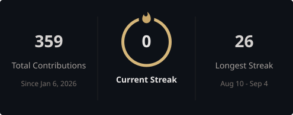

# Aditya Das

  <strong>machine learning</strong>
   · 
  <strong>nlp</strong>
   · 
  <strong>ai systems</strong>

  <a href="https://github.com/aditya-13115">GitHub</a>
  &nbsp;·&nbsp;
  <a href="https://linkedin.com/in/adityadas13115">LinkedIn</a>
  &nbsp;·&nbsp;
  <a href="https://twitter.com/aditya96300662">X</a>
  &nbsp;·&nbsp;
  <a href="https://www.leetcode.com/user4870wq">LeetCode</a>
  &nbsp;·&nbsp;
  <a href="https://instagram.com/aditya_13115">Instagram</a>

 

 

  building intelligent systems, experimenting with models, and occasionally questioning why the model works.

---

## about

<table width="90%">
<tr>
<td align="left" valign="top">

I'm interested in the space between an idea and a working intelligent system.

My work mainly revolves around machine learning, natural language processing,
language models, retrieval systems, agentic workflows, and evaluation.

</td>
</tr>
</table>

---

## currently building

<table width="90%">
<tr>
<td align="center">

<h3>papersift</h3>

  an autonomous ml research agent for paper analysis, retrieval, reasoning,
  tool use, model routing, and reproducible research workflows.

  <a href="https://github.com/aditya-13115/papersift">
    <strong>view repository →</strong>
  </a>

<strong>active project</strong> · currently working

</td>
</tr>
</table>

---

## stack

<table width="100%">
<tr>
<td width="25%" align="center">

**languages**

  

</td>

<td width="25%" align="center">

**ml / ai**

  

</td>

<td width="25%" align="center">

**data**

  

</td>

<td width="25%" align="center">

**engineering**

  

</td>
</tr>
</table>

---

## selected work

<table width="100%">
<tr>
<td width="50%" valign="top">

### resolveiq

Selective, evidence-grounded support agent combining intent classification,
retrieval, grounded generation, and escalation.

 

<a href="https://github.com/aditya-13115/resolveIQ">repository ↗</a>

</td>

<td width="50%" valign="top">

### ringwatch

Explainable risk-intelligence system for connecting evidence and detecting
coordinated refund and return abuse.

 

<a href="https://github.com/aditya-13115/ringWatch">repository ↗</a>

</td>
</tr>

<tr>
<td width="50%" valign="top">

### multiagent-retrievalqa

Multi-agent RAG system combining hybrid retrieval, reranking,
orchestration, and evaluation.

 

<a href="https://github.com/aditya-13115/MultiAgent-RetrievalQA">repository ↗</a>

</td>

<td width="50%" valign="top">

### llmscratch

Large language model architecture implemented from scratch.

 

<a href="https://github.com/aditya-13115/llmScratch">repository ↗</a>

</td>
</tr>

<tr>
<td width="50%" valign="top">

### slm-tinystory

50M parameter small language model trained from scratch in PyTorch
on TinyStories.

 

<a href="https://github.com/aditya-13115/slm-TinyStory">repository ↗</a>

</td>

<td width="50%" valign="top">

### hrrehabapp

AI-powered cardiac rehabilitation prescriber using XGBoost
with strict clinical safety overrides.

 

<a href="https://github.com/aditya-13115/HRrehabAPP">repository ↗</a>

</td>
</tr>
</table>

---

## more experiments

  <a href="https://github.com/aditya-13115/DBMS_agentic">dbms_agentic</a>
  &nbsp;·&nbsp;
  <a href="https://github.com/aditya-13115/taxiRL">taxiRL</a>
  &nbsp;·&nbsp;
  <a href="https://github.com/aditya-13115/deepseek_Scratch">mini-deepseek</a>
  &nbsp;·&nbsp;
  <a href="https://github.com/aditya-13115/recommenderSystem">recommenderSystem</a>
  &nbsp;·&nbsp;
  <a href="https://github.com/aditya-13115/oldLMs">oldLMs</a>
  &nbsp;·&nbsp;
  <a href="https://github.com/aditya-13115/rnn-LSTM">rnn-lstm</a>

---

## github

 

<picture>
  <source
    media="(prefers-color-scheme: dark)"
    srcset="./profile/stats-dark.svg"
  />
  <source
    media="(prefers-color-scheme: light)"
    srcset="./profile/stats-light.svg"
  />
  
</picture>

<picture>
  <source
    media="(prefers-color-scheme: dark)"
    srcset="./profile/top-langs-dark.svg"
  />
  <source
    media="(prefers-color-scheme: light)"
    srcset="./profile/top-langs-light.svg"
  />
  
</picture>

  

<picture>
  <source
    media="(prefers-color-scheme: dark)"
    srcset="./profile/streak-dark.svg"
  />
  <source
    media="(prefers-color-scheme: light)"
    srcset="./profile/streak-light.svg"
  />
  
</picture>

---

## contribution map

<picture>
  <source
    media="(prefers-color-scheme: dark)"
    srcset="https://raw.githubusercontent.com/aditya-13115/aditya-13115/output/github-contribution-grid-snake-dark.svg"
  />
  <source
    media="(prefers-color-scheme: light)"
    srcset="https://raw.githubusercontent.com/aditya-13115/aditya-13115/output/github-contribution-grid-snake.svg"
  />
  
</picture>

  

build → break → understand → rebuild

 

  

